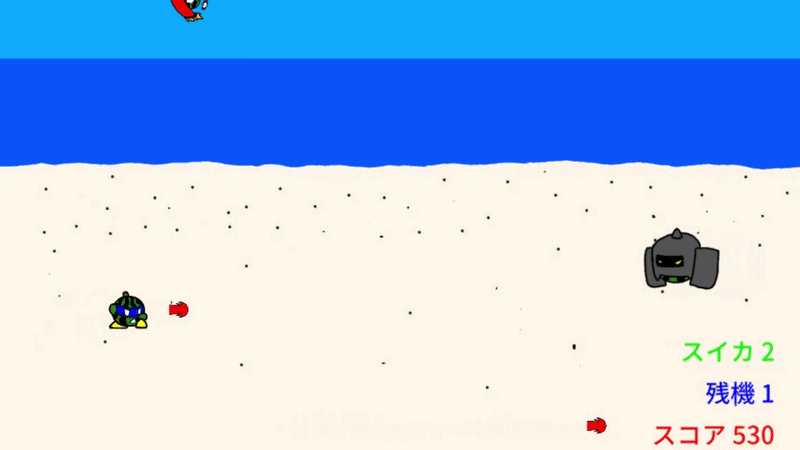

# 2Dシューティングゲーム　カースィ


## 概要
初めて作成したシンプルな2Dシューティング。文化祭展示用で1プレイ10分程度に収まるようにしています。  
通常射撃とボムで次々と迫ってくる敵を倒しスコアを稼ごう。残機がなくなるか強制終了をするとリザルトに行きます。

## 開発環境
### 体制
個人制作
### ゲームエンジン
Unity2021.3.2f1
### 言語
C#

## 工夫した点
* 長押しにより弾を上限まで連射する機能を付けました。長押し連射が最適な手段になると練度による差が出にくくなるため、手動連射よりも遅く設計しています。
* ゲームプレイが単調にならないよう、獲得スコアに応じて敵の生成パターンが変化するようにしました。生成される数や頻度が増加したり、強力な敵が生成されたりします。
* 敵の生成において、強い敵ばかりが生成されないよう、敵ごとに生成の優先度を割り当てました。GameObjectとInt型を持つ構造体により対応付けを行っています。
* 一定スコア刻みで残機とボム回復アイテムを出現するようにしました。さらに一定スコア以上になると時間経過でも出現するようにしました。積極的にスコアを稼ぐ立ち回り、回避に専念して打開を狙う立ち回りどちらも可能です。
* 射撃を行う敵は一定周期で弾を撃つことで弾幕を形成します。しかし、撃つタイミングが全く同じである場合、安全地帯ができやすいため、出現後最初の1発目はランダムなタイミングで撃ちます。
* ゲームオブジェクトのTagによるプレイヤー、敵、アイテム等の識別を実装しました。これによりダメージ処理や残機、ボム回復処理が行われています。
* プレイヤーが撃墜された時、一定時間無敵にするようにしました。無敵中は自機が半透明状態になります。点滅と半透明どちらを取るか考えた際、常にプレイヤーの目に映っている方が良いと考え半透明にしました。点滅より処理が重いと考えられますが、簡単なつくりのゲームなら問題ないと判断しました。
* EscとUIボタンによるゲーム終了機能をWebGL版のみ無効化しました。

## プロジェクト構成
以下は一部省略したものです。
```
Assets/
└ Scenes/                 
  ├ ACTION/               # アクション部分に関わるスクリプト群。
  | ├ ENEMY/              # 敵の挙動や攻撃オブジェクト等の実装。
  | ├ ITEM/               # ボムと残機を回復するアイテムの機能実装。
  | └ PLAYER/             # プレイヤーの挙動や攻撃オブジェクト等の実装。
  ├ EXPLANATION/          # 説明書シーンのUI機能実装。
  ├ RESULT/               # リザルトシーンのUI機能実装。
  └ TITLE/                # タイトルシーンのUI機能実装。
```

## 操作方法（PC / ゲームパッド）
### UI操作
今回GitHubやUnityRoomに公開するにあたりExploreFirstDungeonと同じ仕様に変更。
* カーソル移動：WASDキーまたはArrowキー / LスティックまたはDパッド
* ボタン選択：Enterキー / Eastボタン
### キャラクター操作
* 移動：WASDキー / LスティックまたはDパッド
* 弾発射（連射は長押し）：Spaceキー / Eastボタン
* ボム（スイカ1つ以上ある場合）：Bキー / Northボタン
* 強制リザルトシーン：Jキー / Startボタン
### 強制終了について
Escキーを押すことによって強制的にアプリを終了できます（WebGL版では機能しません）。

## UnityRoomへのアクセス
[こちら](https://unityroom.com/games/suika_2dshooting)からUnityRoomで公開されているものを遊ぶことができます。

## YouTube限定公開リンク
[こちら](https://youtu.be/VO8IDStgJUg)から動画を視聴できます。
